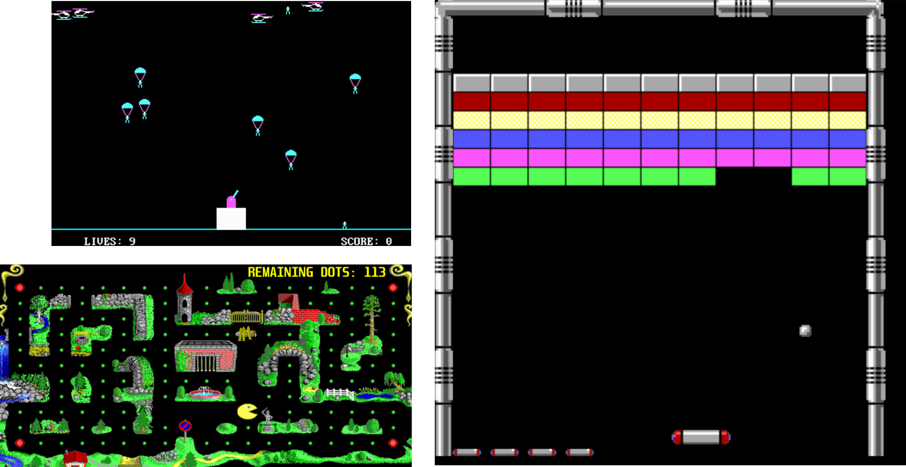
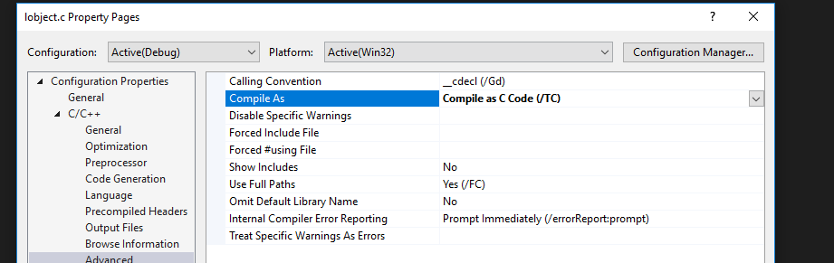

# ofxAPH - Old materials for MI-APH



## About the project
- first of all, this project **is not maintained anymore!** It was used to showcase the component architecture in the first run of the Architecture of Computer Games course at FIT CTU in 2017
- in 2018, I rewrote the component model into TypeScript to make deployment and online showcasing a lot easier
- this project is written in C++ and contains a subset of a component-oriented [game engine](https://github.com/dodolab/CogEngine) I built in 2015. Both run on top of [OpenFrameworks](https://openframeworks.cc) framework.

## What you can find here
- some examples and three games written in Component Architecture: Paratrooper, Pacman, and Arkanoid. Arkanoid is partially implemented in Lua scripting language

## How to start
- download [OpenFrameworks](https://openframeworks.cc) framework (it has to be version 0.10.0, the newer ones won't work)
- clone the content of this repository into your OpenFrameworks folder (OF/addons/ofxAph)
- Run ProjectGenerator (in the OF root directory) and create an empty project
- Select ofxAph as your addon
- Copy the **Data** folder into the bin directory of your new project
- Open your new project and go to `main.cpp`
- Run any of the examples by including the right header

```cpp

#include "ofMain.h"
// replace this header by anything declared below
#include "example"

int main( ){

	ofSetupOpenGL(1024,768, OF_WINDOW);
	ofRunApp(new TwistExample());

}
``` 

### Examples
- `ComponentExample.h` - an example of the component architecture
- `PathFindingExample.h` - simple pathfinding
- `PerlinNoiseExample.h` - Perlin Noise generator
- `QuadTreeExample.h` - Quad Tree viewer
- `VerletExample.h` - Verlet integration showcased on a cloth simulation
- `PacmanApp.h` - Pacman Clone
- `AIAgentsApp.h` - client/server mini RTS
- `ParatrooperApp.h` - Copter shooting g
- `ArkanoidApp.h` - Arkanoid Clone

### If it doesn't work
- the common problem is Lua interpreter, located in `libs/lua`
- you have got to go to every `*.c` file and set up VS to compile it as C code

